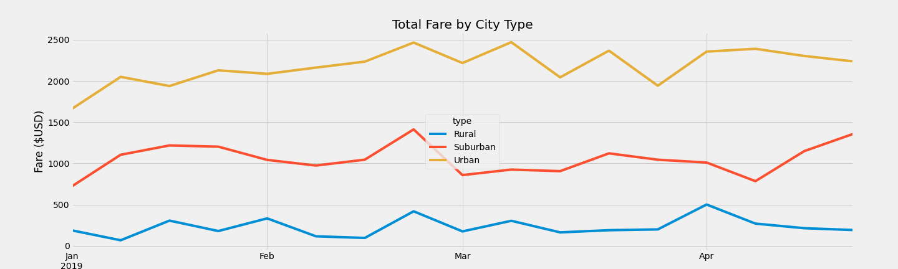

# PyBer_Analysis

## Project Overview

The new analysis performed here is designed to provide insight into total financial performance over four months in various types of cities. The goal of this analysis is to identify any trends that could guide future decisions on where to staff additional drivers and when. 

## Resources

    -Data Source: ride_data.csv, city_data.csv
    -Software: Python, Jupyter Notebooks, MatPlotLib, Pandas 

## Analysis Results

The analysis of the data is summarized below: 

This analysis indicates several factors about our ride and city data including: 

- The Urban cities have a signifigantly higher population of drivers, and also rides. 
    -However, the average fare per ride and fare per driver are both the lowest in Urban cities. 
-Rural cities have the lowest quantity of drivers and rides, but the highest average fare per ride and driver. 
    -This indicates that rides given in Rural cities are likely much longer distance than Urban cities. 

The analysis below shows the Total Fare by City Type on a weekly basis over the period of 01/01/2019 through 04/29/2019: 

This analysis indicates several key points: 

-The total fare in Urban cities rose sharply from January to Late February, before begining a gradual decline. 
-The Suburban and Rural cities, while lower in total Fare income, were more consistent over the same time period. 

## Summary 

After analyzing the data there are a few reccomendations we would like to make to the senior leadership at Pyber. 

First, Urban locations seem to be overstaffed in drivers compared to other city types. We reccomend further analysis including the wait time between driver call and driver arrival in Urban cities. 

Based upon the wait time analysis, PyBer should look into options to incentivize Urban drivers to work shifts in Rural cities. With the average cost per fare much higher in Rural areas drivers should be able to offset the fuel costs of driving out to the Rural cities. 

Additionally further analysis based on time and day of the week of the ride call could provide insight into popular days in specific city types. Day of the week analysis can tell us peak times for driver demand and we could use this data to send prompts to drivers who are off-duty on peak days/hours letting them know of high demand and the potential to work extra shifts. 

Lastly, we could look for mechanisms to pull in calendars of events in specific cities such as concert information. We could then analyze this event information against the popular days and times of rides to see if major events can be used as indicators of potential increases in ride demand. This correlation could lead to additional driver incentives and prompts to proactively staff for these events. 